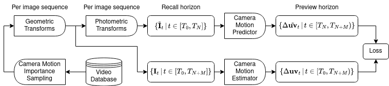

# Homography Imitation Learning
This repository holds the source code for:

- [Deep Homography Prediction for Endoscopic Camera Motion Imitation Learning](https://arxiv.org/abs/2307.12792)
- [Deep Homography Estimation in Dynamic Surgical Scenes for Laparoscopic Camera Motion Extraction](https://arxiv.org/abs/2109.15098)

Inference code for these papers can be found [here](https://github.com/RViMLab/endoscopy).

This repository is under active development and might change. See details below.

## Create Environment
Create environment
```shell
conda create -n hil_torch2 # names in env_*yml
```

Install dependencies with `mamba` (quicker)
```shell
mamba env update -f env_hil_torch2.yml
```

## Code Structure
This code is built with [PyTorch Lightning](https://lightning.ai/docs/pytorch/stable/). A refactoring is necessary at some point.

- Neural networks under [lightning_modules](lightning_modules/)
- Data loaders under [lightning_data_modules](lightning_data_modules/)
- Code is configured via `yaml` files in [config](config/)
- Code is run via `main_*.py` (this needs fix, single main desired)
- Dependencies are handled via [Anaconda](https://www.anaconda.com/) in `env_*.yml` files

## Papers
### Deep Homography Prediction for Endoscopic Camera Motion Imitation Learning
Main idea: Learn camera motion (expressed via homographies) from estimated camera motion.

Source lives under [lightning_modules/homography_imitation](lightning_modules/homography_imitation/).



Figure 1 paper: Training pipeline, refer to Section 2.3. From left to right: Image sequences are importance sampled from the video database and random augmentations are applied per sequence online. The lower branch estimates camera motion between subsequent frames, which is taken as pseudo-ground-truth for the upper branch, which learns to predict camera motion on a preview horizon

#### Citation
```bibtex
@inproceedings{huber2023deeppre,
    author="Huber, Martin and Ourselin, S{\'e}bastien and Bergeles, Christos and Vercauteren, Tom",
    title="Deep Homography Prediction for Endoscopic Camera Motion Imitation Learning",
    booktitle="Medical Image Computing and Computer Assisted Intervention -- MICCAI 2023",
    year="2023",
    publisher="Springer Nature Switzerland",
    address="Cham",
    pages="217--226",
    isbn="978-3-031-43996-4"
}
```

### Deep Homography Estimation in Dynamic Surgical Scenes for Laparoscopic Camera Motion Extraction
Main idea: Learn camera motion and ignore other motion, such as object motion.

Source lives under [lightning_modules/homography_regression](lightning_modules/homography_regression/)


Figure 3 paper: Deep homography estimation training pipeline. Image pairs are sampled from the HFR da Vinci surgery dataset. The homography generation algorithm then adds synthetic camera motion to the augmented images, which is regressed through a backbone DNN.

#### Citation
```bibtex
@article{huber2022deepest,
  title={Deep homography estimation in dynamic surgical scenes for laparoscopic camera motion extraction},
  author={Huber, Martin and Ourselin, S{\'e}bastien and Bergeles, Christos and Vercauteren, Tom},
  journal={Computer Methods in Biomechanics and Biomedical Engineering: Imaging \& Visualization},
  volume={10},
  number={3},
  pages={321--329},
  year={2022},
  publisher={Taylor \& Francis}
}
```
